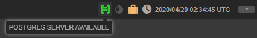
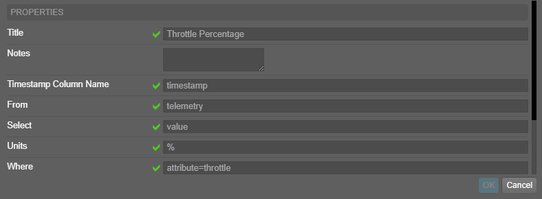

# PostgreSQL Telemetry Adapter
A telemetry adapter for OpenMCT allowing for both real-time and historical telemetry queries to a PostgreSQL database. 

## Prerequisites
This plugin assumes that your server is running `express` and `express-ws` as it uses those to configure the routes and communicate to the web clients.

## Usage
Create a postgres database and a user for OpenMCT to use for queries. This user should have minimal permissions, readonly to tables that contain telemetry. 

### Connecting to the database
The following environment variables are **REQUIRED** to be set
| Variable | Value |
|----------|-------|
| OPENMCT_POSTGRES_USERNAME   |   username for openmct to log into the database |
| OPENMCT_POSTGRES_PASSWORD   |   password for openmct to log into the database |
| OPENMCT_POSTGRES_DATABASE   |   name of the database to connect to |

Optionally, the following two variables can be used to point the postgres connection to a specific server
| Variable | Value | Default |
|----------|-------|---------|
| OPENMCT_POSTGRES_HOST       |   host of the postgres server | localhost |
| OPENMCT_POSTGRES_PORT       |   port on the postgres server | 5432 |

If the database connection is successful, the following icon will be green at the top of the OpenMCT webpage indicating that a successful connection has been made. If the icon is not green there is most likely some connection configuration that invalid or firewall rules blocking the connection. This connection indicator will be frequently updated to visually indicate at any time if the database becomes unavailable. 



### Creating Telemetry
The user-created `Postgres Telemetry` type can be used to specify a database query specific to the telemetry you wish to view.

1. REQUIRED `Timestamp Column Name` indicates which column in the table is to be used as a timestamp. The column should be of type "timestamp" in the table definition.
2. REQUIRED `From` indicates the name of the table to query
3. REQUIRED `Select` indicates which column in the table is to be used for the measurement values
4. `Units` is a label to apply in graphs to indicate the units of the measurements
5. `Where` provides an additional filter to queries in case the table being queried stores multiple kinds of telemetry

For accessing telemetry, http connections are made to queries of the form `/data/postgres/:operation/:table/:timestamp/:value?:filter`. The parameters in this url path are directly substituted for the values indicated by the telemetry object's configuration. The operation in the url changes depending on what kind of data is being accessed. Make sure the postgres user has select access to the table in question. For historical telemetry this is all the configuration that is required. For live telemetry one more step must be taken.

#### Listening To Live Telemetry
For live telemetry, a websocket is established to the server to transmit the data. The server uses `pg_listen` to listen to a channel with the name `openmct.:table` where the table is defined by the telemetry object and then pass that data to the OpenMCT web client. However to make this work, postgres must be configured to fire off notifications to the listening web server. This can be done by manually triggering a notification, for example to notify listener listening to a table named "telemetry" the following query could be used `SELECT pg_notify('openmct.telemetry', 'any message')`. Setting up a trigger for insertion into the table which can fire off these notifications would be an easy way to make sure that all new telemetry is immediately pulled down onto any listening OpenMCT client. 

OpenMCT Web Client <--> Websocket <--> OpenMCT Web Server <-- pg_notify <-- PostgreSQL Server

The following is an example trigger for notifying OpenMCT of new telemetry data in the "telemetry" table when listening for live data.
```sql
CREATE OR REPLACE FUNCTION openmct_telemetry_notify() RETURNS trigger AS 
$$
BEGIN
	PERFORM pg_notify('openmct.telemetry', 'new telemetry');
  RETURN NULL;
END;
$$ language plpgsql;

CREATE TRIGGER trigger_openmct_telemetry_change_notification AFTER INSERT 
  ON telemetry
  FOR STATEMENT
    EXECUTE PROCEDURE openmct_telemetry_notify();
```

## Installation
If you are using my [OpenMCT Template](https://github.com/qkmaxware/openmct-template.git) simply clone this repo into `./plugins/openmct-postgres` and add the following config to the server's package.json.
```diff
  "plugins": {
+    "postgres": {
+      "client": "plugins/openmct-postgres/plugin.client.js",
+      "server": "plugins/openmct-postgres/plugin.server.js"
+    }
  },
```

If you are using a different installation of OpenMCT, first, include the plugin.js file into the index.html and install it the traditional way.
```diff
<!DOCTYPE html>
<html>
<head>
    <meta charset="utf-8">
    <meta name="viewport" content="width=device-width, initial-scale=1.0, maximum-scale=1.0, user-scalable=0, shrink-to-fit=no">
    <meta name="apple-mobile-web-app-capable" content="yes">
    <title><%= name %> - <%= version %></title>
    <script src="openmct/openmct.js"></script>
    <link rel="icon" type="image/png" href="openmct/favicons/favicon-96x96.png" sizes="96x96" type="image/x-icon">
    <link rel="icon" type="image/png" href="openmct/favicons/favicon-32x32.png" sizes="32x32" type="image/x-icon">
    <link rel="icon" type="image/png" href="openmct/favicons/favicon-16x16.png" sizes="16x16" type="image/x-icon">

    <script src="static/lib/http.js"></script>
+    <script src="plugins/openmct-postgres/plugin.client.js"></script>
</head>
<body>
    <script>
    ...
+    openmct.install(postgres());

    openmct.start();
    </script>
</body>
```
Then include the server-side telemachus proxy in your app.js.
```diff
const app = express();
...
+const postgres_telemetry = require("plugins/openmct-postgres/plugin.sever");
+postgres_telemetry(app);
...
app.listen(port, function () {
    console.log('Open MCT hosted at http://localhost:' + port);
});
```